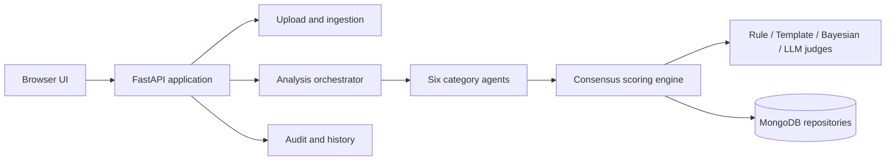

# Contract Risk Analyzer

<p align="center">
  <strong>Explainable, confidence-aware contract risk analysis for enterprise review workflows.</strong>
</p>

<p align="center">
  <a href="https://github.com/Tirumala2824/contract-risk-analyzer"></a>
  
  
  
</p>

Contract Risk Analyzer is an enterprise-oriented application for uploading contracts, coordinating multi-agent analysis, producing category-level risk scores, and presenting explainable review recommendations. It combines deterministic rules, reference-template comparison, Bayesian assessment, and optional LLM judging within a confidence-aware decision pipeline.

> **Important:** This repository is an organized engineering snapshot of the supplied project. It is intended for continued development and integration. It does not provide legal advice and must not be used as the sole basis for a contractual decision.

## Project at a glance

| Area | Current implementation |
| --- | --- |
| Backend | FastAPI application with upload, analysis, audit, history, and health endpoints |
| Frontend | Static HTML, CSS, and JavaScript pages for upload, status, results, summary, and history |
| Risk domains | Legal, Compliance, Financial, Operational, Security, and Fraud |
| Consensus | Rule, template, Bayesian, and LLM judging strategies |
| Persistence | MongoDB-oriented repositories and audit records |
| Document inputs | PDF, DOCX, and XLSX according to the supplied environment template |
| Reference materials | Enterprise scoring policy PDF and product walkthrough video in `docs/assets/` |

## Start here

| Need | Where to look |
| --- | --- |
| Understand the product | This README |
| Understand the request flow | [`docs/architecture.md`](docs/architecture.md) |
| Understand score bands and decisions | [`docs/scoring-policy-summary.md`](docs/scoring-policy-summary.md) |
| Review the authoritative scoring rules | [`docs/assets/enterprise-contract-risk-scoring-policy.pdf`](docs/assets/enterprise-contract-risk-scoring-policy.pdf) |
| Watch the supplied walkthrough | [`docs/assets/contract-risk-analyzer-demo.mp4`](docs/assets/contract-risk-analyzer-demo.mp4) |
| Review release history | [`CHANGELOG.md`](CHANGELOG.md) |

## Core capabilities

The application is structured around a complete contract-review workflow. A user submits a contract through the browser interface; the backend validates and ingests the document; category agents examine the contract against risk parameters; the scoring engine combines judge outputs; and the UI exposes scores, confidence, evidence, recommendations, and history for review.

The six policy categories are intentionally independent so that legal, compliance, financial, operational, security, and fraud concerns can be reviewed separately before the overall contract state is determined.

## Policy-driven scoring

The supplied enterprise policy defines a 0–100 score for each category, where higher values represent greater risk. Each category calculates weighted deterministic sub-risks, then combines four judge scores using the following policy weights:

```text
Final Score = 0.30 × Rule + 0.30 × Template + 0.25 × Bayesian + 0.15 × LLM
```

| Score | Risk level | Typical interpretation |
| --- | --- | --- |
| 0–20 | Low | Limited identified risk |
| 21–40 | Medium | Manageable risk requiring normal controls |
| 41–60 | High | Senior legal review may be appropriate |
| 61–80 | Very High | Escalation and human review are expected |
| 81–100 | Critical | Mandatory human review is expected |

Confidence is derived from disagreement among the judges. Category actions roll up into the overall contract state: any mandatory-review category produces `BLOCKED`; otherwise, any senior-review category produces `PENDING REVIEW`; otherwise, the result is `AUTO-APPROVED` and remains logged for audit.

The concise implementation-oriented summary is in [`docs/scoring-policy-summary.md`](docs/scoring-policy-summary.md). The PDF in [`docs/assets/`](docs/assets/) remains the authoritative supplied source.

## Architecture



The component-level explanation is available in [`docs/architecture.md`](docs/architecture.md). The source layout is intentionally separated into routes, services, agents, scoring, repositories, interfaces, and models so later hardening work can be isolated and reviewed.

## Local development

### Prerequisites

Use Python 3.10 or newer, a MongoDB deployment reachable by the backend, and an Azure OpenAI deployment if LLM-backed judging is enabled. The dependency list includes FastAPI, document-processing libraries, MongoDB drivers, LlamaIndex integrations, and test tooling.

### Setup

```bash
git clone https://github.com/Tirumala2824/contract-risk-analyzer.git
cd contract-risk-analyzer

python3 -m venv .venv
source .venv/bin/activate
python -m pip install --upgrade pip
python -m pip install -r requirements.txt

cp .env.example .env
# Edit .env with values for MongoDB and Azure OpenAI in your environment.

uvicorn backend.main:app --reload --host 127.0.0.1 --port 8000
```

Open <http://127.0.0.1:8000/> in a browser. The health endpoint is <http://127.0.0.1:8000/health>.

To run the Azure OpenAI connectivity check after configuration:

```bash
python -m backend.scripts.verify_azure_connection
```

To perform the source-level validation used for this repository snapshot:

```bash
python -m compileall -q backend
```

## Configuration and data safety

The backend reads environment variables from `.env`. The repository contains only blank placeholders in `.env.example`; populated credentials must never be committed.

| Configuration area | Variables |
| --- | --- |
| Azure OpenAI | `AZURE_OPENAI_API_KEY`, `AZURE_OPENAI_URL`, `AZURE_OPENAI_MODEL`, `AZURE_EMBEDDING_MODEL`, `AZURE_OPENAI_API_VERSION` |
| MongoDB | `MONGODB_USERNAME`, `MONGODB_PASSWORD`, `MONGODB_HOST`, `MONGODB_DATABASE`, `MONGODB_USE_SRV` |
| Application | `APP_NAME`, `APP_VERSION`, `DEBUG` |
| Uploads | `MAX_FILE_SIZE_MB`, `ALLOWED_EXTENSIONS`, `UPLOAD_DIR` |

Confidential contract samples from the supplied archive were not committed. Runtime uploads are excluded by `.gitignore`, and `uploads/.gitkeep` is retained only to preserve the directory in Git. Before production use, review authentication, authorization, CORS restrictions, malware scanning, encryption, retention, audit access, rate limiting, and secret management.

## Repository maturity

This publication is a **source snapshot prepared for continued engineering**, not a production certification. The next recommended engineering steps are to add automated scoring and route tests, pin and audit dependencies, introduce identity and authorization controls, restrict CORS, add structured observability, and formalize a deployment configuration.

The project’s initial publication and cleanup decisions are recorded in [`CHANGELOG.md`](CHANGELOG.md). No open-source license was supplied with the project, so no permissive license is implied by this repository.

## Maintainer

Maintained under [Tirumala2824’s GitHub profile](https://github.com/Tirumala2824). For collaboration, open an issue or pull request with a focused description, reproducible steps, and validation evidence.
